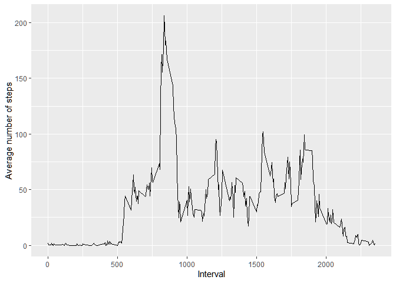

## Loading and preprocessing the data
1. Load the data (i.e. read.csv())

```r
library(tidyverse)
```

```
## -- Attaching packages --------------------------------------- tidyverse 1.3.0 --
```

```
## v ggplot2 3.3.3     v purrr   0.3.4
## v tibble  3.0.6     v dplyr   1.0.4
## v tidyr   1.1.2     v stringr 1.4.0
## v readr   1.4.0     v forcats 0.5.1
```

```
## Warning: package 'ggplot2' was built under R version 4.0.3
```

```
## Warning: package 'tibble' was built under R version 4.0.3
```

```
## -- Conflicts ------------------------------------------ tidyverse_conflicts() --
## x dplyr::filter() masks stats::filter()
## x dplyr::lag()    masks stats::lag()
```

```r
data1 <- read_csv("activity/activity.csv")
```

```
## 
## -- Column specification --------------------------------------------------------
## cols(
##   steps = col_double(),
##   date = col_date(format = ""),
##   interval = col_double()
## )
```
2. Process/transform the data (if necessary) into a format suitable for your analysis

```r
data_na<-na.omit(data1) 
```
## What is mean total number of steps taken per day?

1. Make a histogram of the total number of steps taken each day

```r
steps<-aggregate((data_na$steps), by=list(date=data_na$date), sum)
head(steps)
```

```
##         date     x
## 1 2012-10-02   126
## 2 2012-10-03 11352
## 3 2012-10-04 12116
## 4 2012-10-05 13294
## 5 2012-10-06 15420
## 6 2012-10-07 11015
```

```r
hist(steps$x, main="Histogram of total number of steps per day", 
     xlab="Total number of steps in a day")
```

<!-- -->
2. Calculate and report the mean and median total number of steps taken per day

```r
mean(steps$x)
```

```
## [1] 10766.19
```

```r
median(steps$x)
```

```
## [1] 10765
```
## What is the average daily activity pattern?

1. Make a time series plot (i.e. type = "l") of the 5-minute interval (x-axis) and the average number of steps taken, averaged across all days (y-axis)

```r
interval<-aggregate((data_na$steps), by=list(interval=data_na$interval), mean)

p <- ggplot(interval, aes(x=interval, y=x)) +
  geom_line() + 
  xlab("Interval")+
  ylab("Average number of steps")
p
```

<!-- -->
2. Which 5-minute interval, on average across all the days in the dataset, contains the maximum number of steps?

```r
interval[interval$x == max(interval=interval$x),]
```

```
##     interval        x
## 104      835 206.1698
```


## Imputing missing values
1. Calculate and report the total number of missing values in the dataset (i.e. the total number of rows with NAs)

```r
length(which(is.na(data1$steps)))
```

```
## [1] 2304
```
2. Devise a strategy for filling in all of the missing values in the dataset. The strategy does not need to be sophisticated. For example, you could use the mean/median for that day, or the mean for that 5-minute interval, etc.

3. Create a new dataset that is equal to the original dataset but with the missing data filled in.


```r
data2<-data1
for (i in 1:nrow(data2)){
  if(is.na(data2$steps[i])){
    
    if(length(steps[steps$date2==data2$date[i], ]$x)==0){
      data2$steps[i]<-interval[interval$interval==data2$interval[i], ]$x
    }else{
      data2$steps[i]<-steps[steps$date==data2$date[i], ]$x
    }
  }
}
```


4. Make a histogram of the total number of steps taken each day and Calculate and report the mean and median total number of steps taken per day. Do these values differ from the estimates from the first part of the assignment? What is the impact of imputing missing data on the estimates of the total daily number of steps?


```r
steps_total<-aggregate((data2$steps), by=list(date=data2$date), sum)
head(steps_total)
```

```
##         date        x
## 1 2012-10-01 10766.19
## 2 2012-10-02   126.00
## 3 2012-10-03 11352.00
## 4 2012-10-04 12116.00
## 5 2012-10-05 13294.00
## 6 2012-10-06 15420.00
```

```r
hist(steps_total$x, main="Histogram of total number of steps per day", 
     xlab="Total number of steps in a day")
```

<!-- -->

```r
mean(steps_total$x)
```

```
## [1] 10766.19
```

```r
median(steps_total$x)
```

```
## [1] 10766.19
```


## Are there differences in activity patterns between weekdays and weekends?

1. Create a new factor variable in the dataset with two levels – “weekday” and “weekend” indicating whether a given date is a weekday or weekend day.

```r
data2$day<-weekdays(data2$date,abbreviate=TRUE)

for (i in 1:nrow(data2)) {
  if(data2$day[i]=="Sun" | data2$day[i]=="Sat"){
    
    data2$day[i]<-'Weekend'
  } else {
    data2$day[i]<-'Weekday'
  }
}
data2$day <- as.factor(data2$day)
```
2. Make a panel plot containing a time series plot (i.e. type = "l") of the 5-minute interval (x-axis) and the average number of steps taken, averaged across all weekday days or weekend days (y-axis).

```r
head(data2)
```

```
## # A tibble: 6 x 4
##    steps date       interval day    
##    <dbl> <date>        <dbl> <fct>  
## 1 1.72   2012-10-01        0 Weekday
## 2 0.340  2012-10-01        5 Weekday
## 3 0.132  2012-10-01       10 Weekday
## 4 0.151  2012-10-01       15 Weekday
## 5 0.0755 2012-10-01       20 Weekday
## 6 2.09   2012-10-01       25 Weekday
```

```r
data_summ <- aggregate(steps ~ interval+day, data2, mean)

p2 <- ggplot(data_summ, aes(x=interval, y=steps)) +
  geom_line(aes(colour = day)) + 
  facet_grid(day ~ ., scales="fixed", space="fixed") +
  xlab("Interval")+
  ylab("Number of steps")
p2
```

<!-- -->
